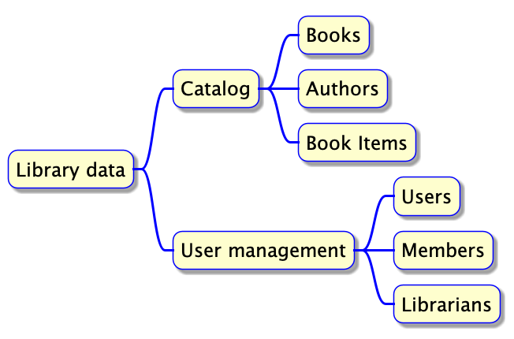
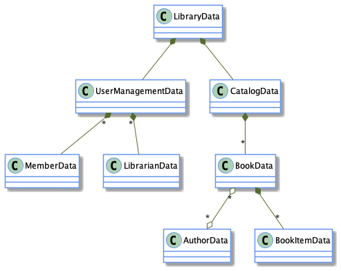

According to Data-Oriented programming, the way to reduce complexity of information systems is to follow three basic principles:

1. Separate code from data
1. Keep data immutable
1. Represent data with generic data structures

Here are a series of 6 short programming challenges and their solutions written in JavaScript according to the principles of Data-Oriented programming. The purpose is to illustrate the simplicity of Data-Oriented programming. 

If you agree with DOP principles, please implement your solutions in the programming language of your choice, according to DOP principles. I'm sure you'll enjoy!

If you disagree with one or more DOP principles, feel free to implement the solutions by breaking one or more principles, and explain why you think that your solution is simpler than the ones that I wrote.

# Rules

1. You are allowed to choose any programming language
1. You are allowed to use any third-party library
1. You are allowed to use reflection
1. In the context of the challenges, simplicity is more important than performances.
1. Submit your code snippets as a pull request to the official book source code [Github repository](https://github.com/viebel/data-oriented-programming), under the `challenges` folder
1. In case you disagree with DOP, please add a few words as comments in your code that explain why you think that your solution is simpler than the ones that I wrote.
1. Four copies of [Data-Oriented programming](https://www.manning.com/books/data-oriented-programming?utm_source=viebel&utm_medium=affiliate&utm_campaign=book_sharvit2_data_1_29_21&a_aid=viebel&a_bid=d5b546b7) will be given away among the folks that submitted a correct solution to at least 4 of the challenges.

# Data model

Here is the library data model in an informal way:

More formally, here is a UML diagram that describes the relationships between the data entities of the library:

Here is an example of library data in JavaScript that we are going to use through this article:

~~~js
var libraryData = {
    "name": "The smallest library on earth",
    "address": "Here and now",
    "catalog": {
        "booksByIsbn": {
            "978-1779501127": {
                "isbn": "978-1779501127",
                "title": "Watchmen",
                "publicationYear": 1987,
                "authorIds": ["alan-moore",
                              "dave-gibbons"],
                "bookItems": [
                    {
                        "id": "book-item-1",
                        "rackId": "rack-17"
                    },
                    {
                        "id": "book-item-2",
                        "rackId": "rack-17"
                    }
                ]
            }
        },
        "authorsById": {
            "alan-moore": {
                "name": "Alan Moore",
                "bookIsbns": ["978-1779501127"]
            },
            "dave-gibbons": {
                "name": "Dave Gibbons",
                "bookIsbns": ["978-1779501127"]
            }
        }
    },
  "userManagement": {
    "librarians": {
      "franck@gmail.com" : {
        "email": "franck@gmail.com",
        "encryptedPassword": "bXlwYXNzd29yZA=="
      }
    },
    "members": {
      "samantha@gmail.com": {
        "email": "samantha@gmail.com",
        "encryptedPassword": "c2VjcmV0",
        "isBlocked": false
      }
    }
  }
};

~~~

# Challenges

## Challenge #1: Retrieve a piece of information

**Challenge**: Write a function named `getBookProperty` that receives and ISBN and a field name and returns the value of the field for the book with the given ISBN

## Challenge #2: Search information

**Challenge**: Write a function named `bookInfo` that receives a string and returns a JSON string that contains book information about the books whose title contains the given string, in a case insensitive way. Book information is made of: title, isbn, author full names.

**Remark**: You are not allowed to extract author names from author ids. Assume that author ids are opaque strings.

# Challenge #3: Add a piece of information

**Challenge**: Write a function named `blockMember` that receives an email address and returns a new version of library data **without altering the original version**, where the user with the given email is blocked.

# Challenge #4: Rename keys in a data entity

**Challenge**: Write a function named `renameKeys` that receives a data entity and a key mappings and returns a new data entity, without altering the original entity, where the fields are renamed according to the key mappings

# Challenge #5: Merge pieces of information

**Challenge**: Write a function named `mergeAndSerialize` that receives two pieces of book information, one from the database and one from an external service like [Open Library Books API](https://openlibrary.org/dev/docs/api/books) and returns a JSON string with information from both sources.

# Challenge #6: Compare versions of data

**Challenge**: Write a function named `diff` that receives two versions of library data and returns an object that contains the diff between the two versions, in the format of your choice.

